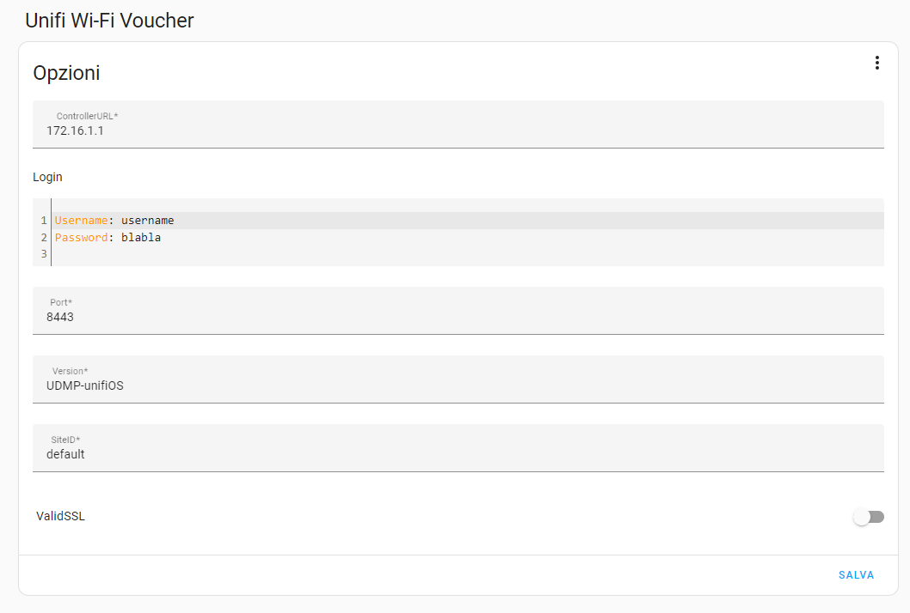
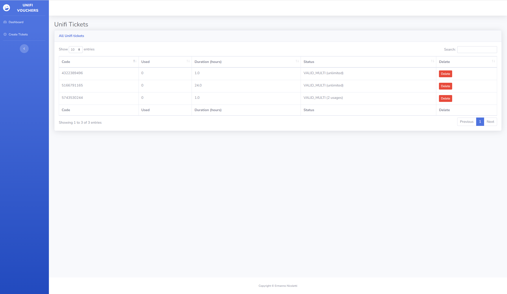
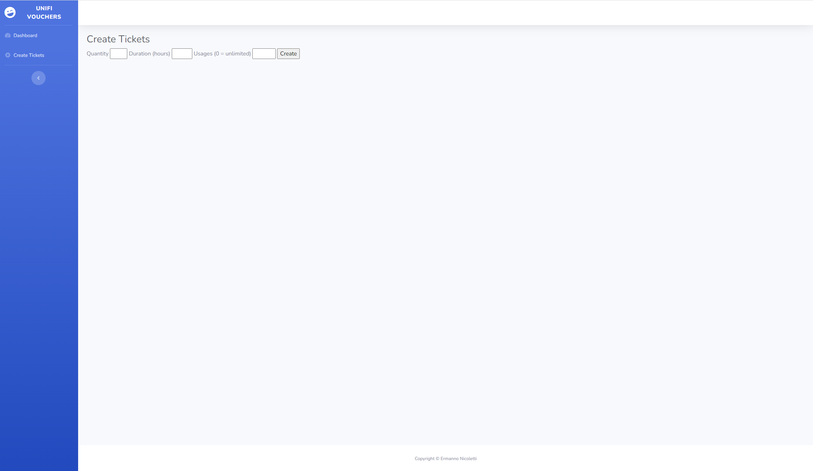

# UniFi Voucher System for Home Assistant

### Summary
A simple add-on to create tickets using your UniFi Controller or UniFiOS (UDM - UDM Pro). 

The add-on is Ingress compatible so runs from wherever you're able to connect to your installation.

### Installation
- Copy _unifi_tickets_ folder into the _addons_ folder of home assistant
- Go to you Home assistant and go to add-ons:  https://my.home-assistant.io/redirect/supervisor_store/
- On the top right overflow menu, click the "Check for updates" button 
- The add-on should now show up, so you should be able to install it
- Fill in the configuration before starting the add-on

### Configuration

Configuration example:

- `ControllerURL`		-- the address of the controller host; IP or name
- `Username`	-- the username to log in with
- `Password`	-- the password to log in with
- `Port`		-- the port of the controller host (if necessary)
- `Version`	-- the base version of the controller API [v4|v5|unifiOS|UDMP-unifiOS]
- `site_id`	-- the site ID to access
- `ValidSSL`	-- Verify the controllers SSL certificate, default=True, can also be False"

### Screenshot

- `Dashboard`

- `Create voucher`

### Credits

Remake of: https://github.com/kbruurs/unifi-hassio

Using:

PyUnifi https://github.com/finish06/pyunifi

Flask https://palletsprojects.com/p/flask/

Jinja https://palletsprojects.com/p/jinja/

Gunicorn https://gunicorn.org/

NGINX https://nginx.org/

SB Admin-2 https://github.com/StartBootstrap/startbootstrap-sb-admin-2